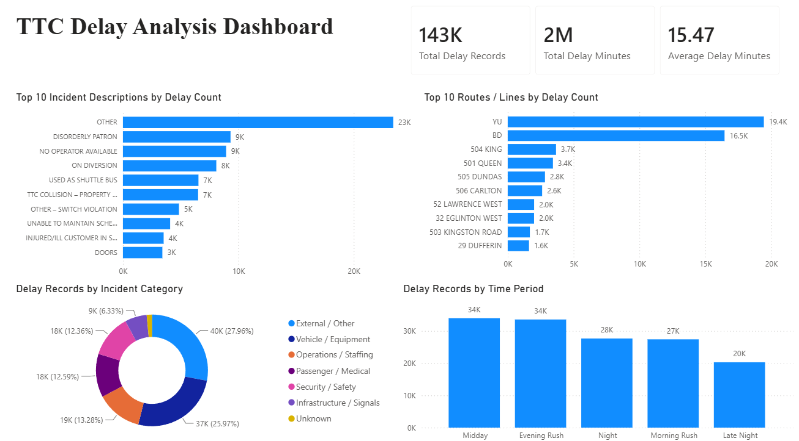

# TTC Transit Delay Analysis

## Project Overview

This project analyzes Toronto Transit Commission (TTC) delay records to identify common causes of service disruptions, compare delay patterns across transit modes, and examine how delays vary by time, route, and incident type.

The project uses Python for data cleaning, MySQL for data storage and analysis, and Power BI for interactive dashboard development.

The main objective is to transform raw TTC delay data into a clean and structured dataset that can be used to answer practical operational questions.

---

## Business Questions

This project focuses on the following questions:

1. Which incident types cause the highest number of TTC delays?
2. Which transit mode experiences the most delay incidents?
3. What is the average delay duration for each transit mode?
4. Which routes experience the highest number of delay incidents?
5. During which hours of the day are delays most frequent?
6. How do delay patterns vary across weekdays?
7. Which incident types contribute the most total delay minutes?

---

## Tools and Technologies

- Python
- Pandas
- MySQL
- SQL
- Power BI
- Power Query
- DAX
- GitHub

---

## Project Workflow

### 1. Data Collection

The project uses publicly available TTC delay datasets containing information such as:

- Date
- Time
- Route
- Location
- Transit mode
- Incident type
- Delay duration
- Gap duration
- Direction
- Vehicle number

Multiple TTC delay files were combined into one dataset for analysis.

---

### 2. Data Cleaning with Python

Python and Pandas were used to clean and standardize the raw datasets.

The main data-cleaning steps included:

- Combining multiple TTC delay files
- Standardizing column names
- Removing unnecessary columns
- Converting date and time fields
- Handling missing values
- Standardizing transit mode values
- Standardizing incident-type values
- Converting delay and gap columns to numeric data types
- Removing invalid or duplicate records
- Creating additional time-based columns

Additional columns created during data cleaning included:

- `year`
- `month`
- `month_name`
- `day_of_week`
- `hour`
- `transit_mode`
- `incident_type`

The cleaned dataset was exported as:

```text
ttc_delay_cleaned.csv
```

---

### 3. Data Storage in MySQL

The cleaned CSV file was imported into MySQL using `LOAD DATA LOCAL INFILE`.

A structured SQL table was created to store the TTC delay records.

Example table structure:

```sql
CREATE TABLE ttc_delays (
    delay_date DATE,
    delay_time TIME,
    route VARCHAR(50),
    location VARCHAR(255),
    incident_type VARCHAR(255),
    delay_minutes INT,
    gap_minutes INT,
    direction VARCHAR(20),
    vehicle VARCHAR(50),
    transit_mode VARCHAR(50),
    year INT,
    month INT,
    month_name VARCHAR(20),
    day_of_week VARCHAR(20),
    hour INT
);
```

Example CSV import statement:

```sql
LOAD DATA LOCAL INFILE
'C:/path/to/ttc_delay_cleaned.csv'
INTO TABLE ttc_delays
FIELDS TERMINATED BY ','
ENCLOSED BY '"'
LINES TERMINATED BY '\n'
IGNORE 1 ROWS;
```

---

## SQL Analysis

SQL was used to analyze delay frequency, duration, routes, incident types, and time patterns.

### Total Delay Incidents

```sql
SELECT
    COUNT(*) AS total_incidents
FROM ttc_delays;
```

### Average Delay Duration

```sql
SELECT
    ROUND(AVG(delay_minutes), 2) AS average_delay_minutes
FROM ttc_delays
WHERE delay_minutes > 0;
```

### Delay Incidents by Transit Mode

```sql
SELECT
    transit_mode,
    COUNT(*) AS incident_count
FROM ttc_delays
GROUP BY transit_mode
ORDER BY incident_count DESC;
```

### Average Delay by Transit Mode

```sql
SELECT
    transit_mode,
    ROUND(AVG(delay_minutes), 2) AS average_delay_minutes
FROM ttc_delays
WHERE delay_minutes > 0
GROUP BY transit_mode
ORDER BY average_delay_minutes DESC;
```

### Most Common Incident Types

```sql
SELECT
    incident_type,
    COUNT(*) AS incident_count
FROM ttc_delays
GROUP BY incident_type
ORDER BY incident_count DESC
LIMIT 10;
```

### Routes with the Most Delay Incidents

```sql
SELECT
    route,
    transit_mode,
    COUNT(*) AS incident_count
FROM ttc_delays
WHERE route IS NOT NULL
GROUP BY route, transit_mode
ORDER BY incident_count DESC
LIMIT 10;
```

### Delay Incidents by Hour

```sql
SELECT
    hour,
    COUNT(*) AS incident_count
FROM ttc_delays
GROUP BY hour
ORDER BY hour;
```

### Delay Incidents by Day of Week

```sql
SELECT
    day_of_week,
    COUNT(*) AS incident_count
FROM ttc_delays
GROUP BY day_of_week
ORDER BY incident_count DESC;
```

### Total Delay Minutes by Incident Type

```sql
SELECT
    incident_type,
    SUM(delay_minutes) AS total_delay_minutes
FROM ttc_delays
WHERE delay_minutes > 0
GROUP BY incident_type
ORDER BY total_delay_minutes DESC
LIMIT 10;
```

---

## Power BI Dashboard

An interactive Power BI dashboard was created to present the main findings.

### Dashboard Page 1: TTC Delay Overview

The first dashboard page provides a high-level overview of TTC service delays.

#### KPI Cards

- Total Delay Incidents
- Average Delay Minutes
- Total Delay Minutes
- Average Gap Minutes

#### Visualizations

- Delay Incidents by Transit Mode
- Average Delay Minutes by Transit Mode
- Top Incident Types
- Delay Incidents by Month



---

### Dashboard Page 2: Time and Route Analysis

The second dashboard page focuses on when and where delays occur.

#### Visualizations

- Delay Incidents by Hour
- Delay Incidents by Day of Week
- Top Routes by Incident Count
- Delay Trends Over Time
- Delay Incidents by Transit Mode and Hour

#### Filters and Slicers

- Transit Mode
- Month
- Day of Week
- Incident Type
- Route


---

## Example DAX Measures

### Total Incidents

```DAX
Total Incidents =
COUNTROWS(ttc_delays)
```

### Average Delay Minutes

```DAX
Average Delay Minutes =
AVERAGE(ttc_delays[delay_minutes])
```

### Total Delay Minutes

```DAX
Total Delay Minutes =
SUM(ttc_delays[delay_minutes])
```

### Average Gap Minutes

```DAX
Average Gap Minutes =
AVERAGE(ttc_delays[gap_minutes])
```

### Bus Delay Incidents

```DAX
Bus Delay Incidents =
CALCULATE(
    COUNTROWS(ttc_delays),
    ttc_delays[transit_mode] = "Bus"
)
```

---

## Key Insights

- Delay frequency differs across TTC transit modes.
- A small number of incident categories account for a large proportion of reported delay incidents.
- The most frequent incident type is not always the incident type with the highest total delay duration.
- Delay incidents are more frequent during high-demand travel periods.
- Certain routes consistently report more delay incidents than others.
- Average delay duration and total incident count provide different perspectives on service performance.
- Route-level incident counts should be interpreted carefully because routes with more frequent service naturally have more opportunities to record delays.
- Time-based analysis helps identify recurring periods of operational pressure.

---

## Repository Structure

```text
ttc-transit-delay-analysis/
│
├── data/
│   ├── raw/
│   │   ├── bus_delay_data.csv
│   │   ├── subway_delay_data.csv
│   │   └── streetcar_delay_data.csv
│   │
│   └── cleaned/
│       └── ttc_delay_cleaned.csv
│
├── python/
│   └── data_cleaning.py
│
├── sql/
│   ├── 01_create_database.sql
│   ├── 02_create_table.sql
│   ├── 03_import_data.sql
│   └── 04_exploratory_analysis.sql
│
├── powerbi/
│   └── ttc_delay_dashboard.pbix
│
├── images/
│   ├── dashboard_overview.png
│   └── dashboard_time_route_analysis.png
│
└── README.md
```

---

## Data Quality Considerations

Several limitations should be considered when interpreting the results:

- Incident reporting practices may differ across transit modes.
- Missing route, location, direction, or vehicle values may affect route-level analysis.
- Delay duration may contain zero values or unusually large values.
- A high number of incidents does not automatically indicate poor route performance.
- Routes with more frequent service may naturally record more incidents.
- The dataset records reported delay incidents but may not capture every passenger-level service impact.
- Incident categories may use different naming conventions across source files.

---

## Skills Demonstrated

This project demonstrates the following data analysis skills:

- Data cleaning with Python and Pandas
- Combining multiple datasets
- Data-type conversion
- Missing-value handling
- Feature engineering
- CSV data export
- MySQL database creation
- SQL data import
- Aggregate SQL queries
- `GROUP BY` analysis
- Time-based analysis
- KPI development
- DAX measure creation
- Power BI dashboard design
- Data visualization
- Business-question development
- Data-quality assessment
- GitHub project documentation

---

## Future Improvements

Potential future improvements include:

- Comparing TTC delay data across multiple years
- Calculating delay rates relative to scheduled service frequency
- Adding geographic route or station maps
- Separating planned and unplanned service disruptions
- Identifying statistical outliers in delay duration
- Building a predictive model for delay severity
- Creating a route-level performance score
- Automating the data-cleaning and database-import process
- Connecting Power BI directly to the MySQL database
- Adding weather data to examine the relationship between weather and TTC delays

---

## Author

**Jim Wang**

Data analysis project using Python, MySQL, and Power BI.
